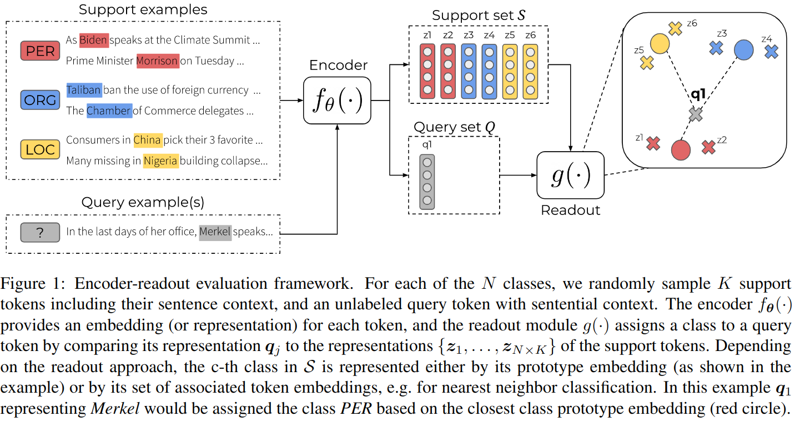

# FewIE: Few-Shot Named Entity Recognition
This is the official implementation of our paper "FewIE"-paper: *A Comparative Study of Pre-trained Encoders for Low-Resource Named Entity Recognition*.



## Table of Contents
- [Introduction](#introduction)
- [Overview](#overview)
- [Installation](#installation)
- [Usage](#usage)
- [Datasets](#datasets)
- [Citation](#citation)
- [License](#license)

## Introduction
This repository is the implementation of our **encoder-readout**  framework, which is on evaluating pre-trained encoders on the task of few-shot NER, across up to now 8 English and 3 German datasets.

## 🔭&nbsp; Overview
|**Path**|**Description**|
|---|---|
|[configs/](./configs/)|This directory contains the Hydra config files that specify pre-defined settings.|
|[datasets/](./data/)|This directory where the user should put their data files.|
|[docs/](./docs/)|This directory contains the auxiliary files for documentation, such as the figure(s)presented in README.|
|[src/fewie/](./src/)|This directory is the package to be installed, which contains the source code of our implementation.|

## 🚀&nbsp; Installation
### From source
```bash
git clone https://github.com/DFKI-NLP/fewie
cd fewie
pip install .
```

### For development
```bash
git clone https://github.com/DFKI-NLP/fewie
cd fewie
pip install -e .
```

## 💡&nbsp; Usage

To run the default experiment setting, run:
```python
python evaluate.py
```

To show the available options and the default config, do:
```python
python evaluate.py --help
```

which results in something like this:
```
== Configuration groups ==
Compose your configuration from those groups (group=option)

dataset: conll2003
dataset_processor: bert, spanbert, transformer
encoder: bert, random, spanbert, transformer
evaluation/classifier: logistic_regression
evaluation/dataset: nway_kshot, nway_kshot_5_1, nway_kshot_na_dedicated, nway_kshot_na_rest


== Config ==
Override anything in the config (foo.bar=value)

dataset:
  _target_: datasets.load_dataset
  path: conll2003
  version: 1.0.0
  split: test
dataset_processor:
  _target_: fewie.dataset_processors.transformer.TransformerProcessor
  tokenizer_name_or_path: ??
  max_length: 128
  label_all_tokens: false
encoder:
  _target_: fewie.encoders.random.RandomEncoder
  embedding_dim: 768
evaluation:
  dataset:
    _target_: fewie.data.datasets.generic.nway_kshot.NwayKshotDataset
    n_ways: 5
    k_shots: 1
    n_queries: 1
    n_samples: 600
    deterministic: false
  classifier:
    _target_: fewie.evaluation.classifiers.logistic_regression.LogisticRegression
    C: 1.0
    penalty: l2
    random_state: 0
    solver: lbfgs
    max_iter: 1000
    multi_class: multinomial
seed: 1234
cuda_device: 0
batch_size: 1
text_column_name: tokens
label_column_name: ner_tags
scenario:
  name: few_shot_linear_readout
  metrics:
  - accuracy
  - f1_micro
  - f1_macro
```

For example to run the evaluation on CoNLL 2003 with a baseline BERT encoder, run the following command:
```sh
python evaluate.py \
    dataset=conll2003 \
    dataset_processor=bert \
    encoder=bert \
    evaluation/dataset=nway_kshot_5_1
```

This should produce an output similar to this:
```json
{"f1_micro": 
  {"mean": 0.22021196408281052, 
    "margin_of_error": 0.018079245331949295, 
    "confidence": 0.95}, 
  "f1_macro": {
    "mean": 0.15039496182777168, 
    "margin_of_error": 0.01310293346782576, 
    "confidence": 0.95}
}
```

## 🔎&nbsp; Datasets

### OntoNotes
Due to licensing restriction, you have to obtain a copy of OntoNotes 5.0 
from LDC yourself: https://catalog.ldc.upenn.edu/LDC2013T19. 

Preprocess the download to obtain a BIO-tagged version of the dataset as 
described here: https://github.com/yuchenlin/OntoNotes-5.0-NER-BIO.

Create a single zip file containing `onto.train.ner`, `onto.development.ner`, and 
`onto.test.ner`. Edit `datasets/ontonotes.py` and change the `_URL` to point to this
zip file.

### CoNLL-2003 German
We share the revised version as provided by the shared task organiser
in 2006 with more consistent annotations (as described here: https://www.clips.uantwerpen.be/conll2003/ner/).

### Zhang et al. eCommerce NER dataset
We provide the version shared by the authors in the file `datasets/lenovo.json`.

## 📚&nbsp; Citation
```
@inproceedings{chen-etal-2022-fewie,
    title = "A Comparative Study of Pre-trained Encoders for Low-Resource Named Entity Recognition",
    author = "Chen, Yuxuan and
      Mikkelsen, Jonas and
      Binder, Arne and
      Alt, Christoph and
      Hennig, Leonhard",
    booktitle = "Proceedings of the 7th Workshop on Representation Learning for NLP",
    month = may,
    year = "2022",
    address = "Online",
    publisher = "Association for Computational Linguistics",
    abstract = "Pre-trained language models (PLM) are effective components of few-shot named entity recognition (NER) approaches when augmented with continued pre-training on task-specific out-of-domain data or fine-tuning on in-domain data. However, their performance in low-resource scenarios, where such data is not available, remains an open question. We introduce an encoder evaluation framework, and use it to systematically compare the performance of state-of-the-art pre-trained representations on the task of low-resource NER. We analyze a wide range of encoders pre-trained with different strategies, model architectures, intermediate-task fine-tuning, and contrastive learning. Our experimental results across ten benchmark NER datasets in English and German show that encoder performance varies significantly, suggesting that the choice of encoder for a specific low-resource scenario needs to be carefully evaluated.",
}
```

## 📘&nbsp; License
FewIE is released under the terms of the [MIT License](./LICENSE.txt).
